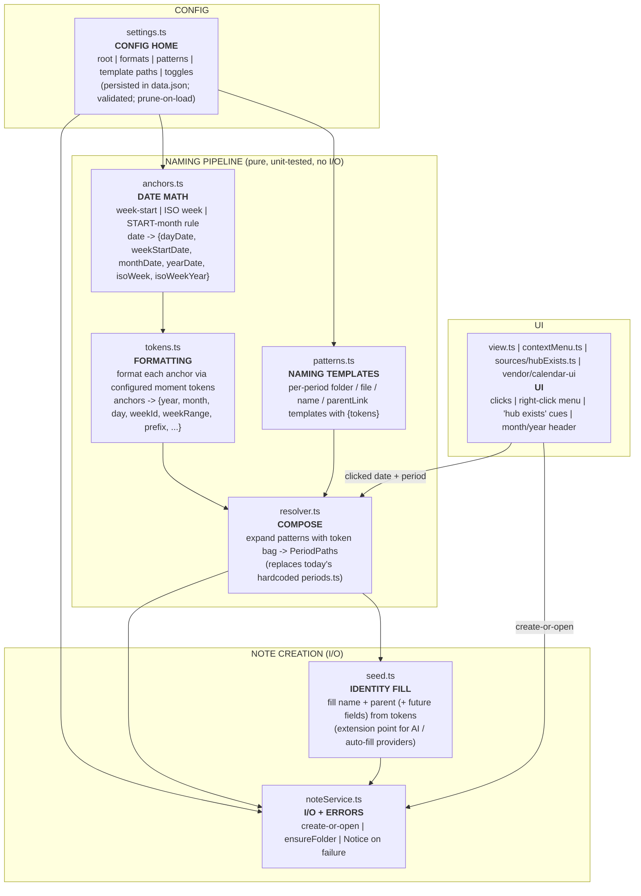

# POLISH PLAN — Generalize & harden the forked Calendar "HUB" plugin

> **What this is.** The feature works (clicking the calendar grid creates/opens
> the `_HUB_*` time hierarchy). This plan is the SECOND pass: make it a *polished,
> general product* — all naming/prefixes/paths driven from a well-designed settings
> page; one clear, modular "computation pipeline" with named blocks (so a future
> feature = edit one block); robust error reporting; nothing vault-specific baked
> into the code. Companion to the creation plan `0_Inbox/plan_for_calendar_plugin.md`
> (which is DONE + committed). The fork lives at
> `/home/cam/Documents/GitHub/obsidian-calendar-plugin` (committed: `ff40267`).
>
> **▶ RESUME PROTOCOL (read FIRST if your context was compacted / you are a fresh
> agent):** This file is the single source of truth for the polish phase — the
> design lives HERE, not in chat. (1) Read this whole file top→bottom. (2) The
> ARCHITECTURE IS NOT YET LOCKED — it is deliberately presented as a *proposal +
> design space*; the depth of the refactor depends on the user's answer to the
> granularity question (§5/Round 1 Q1). (3) Check the GRILLING LOG (§10) for which
> rounds are answered. (4) Do NOT start implementation until the user says the
> design is locked — see "How to work" below. Trust this file, not half-remembered
> chat.
>
> **STATUS:** Diagnosis complete. Design (§13) approved. **IMPLEMENTED + built +
> deployed + headlessly tested (2026-06-04)** — see §14. Remaining = the user's
> in-Obsidian click-through (the HUB_FEATURE.md checklist in the fork).
>
> **Created:** 2026-06-04 (polish phase) for Rishabh. **Vault:**
> `/home/cam/Applications/obsidian_rysabh_github`.

---

## How to work on this (process rules — same spirit as the creation plan)

- [ ] **WRITE EVERYTHING DOWN, IN DETAIL.** A cold agent with zero prior context
      must be able to act from this file alone. Spell out the *why*. Capture all
      adjacent info the user mentions. Length is fine; lost intent is not.
      (Durable user preference — see memory `write-exhaustively`.)
- [ ] **Grill in rounds of FIVE questions**, each question listing the
      **recommended option first** with a clear explanation of every option. Log
      every round verbatim in §10. Do not move to implementation until the user
      signals alignment.
- [ ] **Internal modularity is MAXIMIZED; external knob-count is RESTRAINED.**
      These are different axes (see §3). The user wants the code so modular that a
      feature = surgically editing one block — but they also twice rejected
      "convoluted" designs, so the *number of settings a human must understand*
      stays small and safe. Do not conflate "clean internal pipeline" with "expose
      every internal as a setting."
- [ ] **The dangerous-to-misconfigure math stays in CODE** (nesting structure,
      START-month rule, ISO week computation). Only *formatting and leaf naming*
      become configurable (subject to the granularity decision, Q1). See §9.
- [ ] **Do NOT `git commit`/push unless the user asks.** Building/deploying is
      fine. Back up the vault `main.js` before overwriting (already have
      `main.js.pre-fork.bak`).
- [ ] **Every build/test bash command must `source nvm && nvm use 24`** (the
      non-interactive shell defaults to a broken system Node 12).

---

## §0. The user's asks, verbatim (2026-06-04) — the intent to satisfy

1. **"all setting like prefixes etc. should be part of the settings page. this
   should be a polished product. that can work across diffrent vaults for diffrent
   user preferences. i am using the nomencalteur and template path for my repo..
   but the product should be general."** → Generalize. Their layout is ONE
   configuration of a general tool, not the tool's hardcoded identity.

2. **Git-sync question:** *"i sync my community plugins using git inside obsidian..
   so i think the built plugin will be synched and work fine across different PCs
   and vaults ??? as it uses obsidian native things?? like any other plugin or the
   same plugin before??"* → Answered in §2.1.

3. **"Prefilled paths / leaking my vault" question:** *"when i open the plugin for
   the first time.. all the things and paths are prefilled?? are you leaking my
   vault data into the plugin?? also FYI it was filled with the MT_ paths."* →
   Answered in §2.2.

4. **Missing-template must be reported:** *"if lets say the template path does not
   exist.. it should say that. this caused confusion earlier.. the path was
   incorrect and when i pressed confirm to create new file.. nothing happened. i
   should be notified that the template does not exist if such is the case."* →
   The confirmed BUG A (§1.1). Two-layer fix in §6.

5. **Naming must be settings-driven, by example:** *"suppose i want the new files
   to be named `_HUB_Day_Jun_04_2026` instead of `_HUB_Day_Jun04_2026` → this
   should be feasible with setting adjustments. now this was just an example, i
   want you to think through the proper architecture... all the naming scheme and
   adjustments should be possible from settings. ISO setting etc."* → §4/§5.

6. **Computation pipeline (the architecture ask):** *"the name frontmatter in
   hub_week is automatically filled with `_HUB_Week_Jun01-07_2026`.. this is kind
   of overfitting to my vault pattern. if you are computing something
   automatically.. it should be through a proper computation pipeline... like the
   name of the file `_HUB_Week_23_2026`, related notes names `_HUB_Month_Jun_2026`
   etc. this modularity will allow to add various features in the future and keep
   things modular. suppose in the future i want to add some ai based feature for
   autofilling something. Right now the architecture is so scattered that i don't
   know what module is doing what."* → §4 (pipeline + mermaid + block roles), §5
   (config), Round 1 Q4 (the autofill/extension point).

7. **Mermaid + block roles + surgical edits:** *"create a proper mermaid block
   diagram for the architecture and all the blocks should have assigned roles. so
   i want some feature, i edit a block surgically and everything works. so refactor
   the code accordingly after you have decided upon the flow."* → §4.

8. **Cleanliness / future-proofing:** *"read the code again and make sure that
   nothing unnecessary has leaked into the main code... unnecessary artifacts etc.
   also, the plugin is future proof and reliable and manageable."* → §8 (cruft
   audit).

9. **Deliverable:** *"finally write a `0_Inbox/adjust_calendar_settting.md` that
   tells me exactly how to modify the settings to get my pattern."* → §7. It also
   doubles as the GENERALIZATION ACCEPTANCE TEST: if the user's exact current
   layout is reproducible *purely through settings*, generalization is correct.

---

## §1. Diagnosis — verified on disk (the actual problems, with evidence)

### §1.1 BUG A — "I press Create and nothing happens" (silent create failure)

**Root cause (two compounding faults):**

1. **The deployed `data.json` points at template files that do not exist.**
   `.obsidian/plugins/calendar/data.json` currently has:
   - `hubTemplates.year` = `…/Obsidian_Templates/`**`Dynamic`**`/ST_HUB_Year.md`
     — but the real file is `…/`**`Static`**`/ST_HUB_Year.md`.
   - `overviewTemplate` = `…/`**`Dynamic`**`/ST_Overview_Day_`**`Today`**`.md`
     — but the real file is `…/`**`Static`**`/ST_Overview_Day.md`.
   These are STALE values left over from an earlier build (see §1.2 for *why*
   stale values survive).

2. **When the template is missing, the error is swallowed.**
   `noteService.buildAndOpen()` correctly `throw`s
   `"[Calendar] Static template not found: …"`. But the throw propagates into the
   confirm-modal's click listener, which is:
   ```ts
   // src/ui/modal.ts
   .addEventListener("click", async (e) => {
     await onAccept(e);   // <- onAccept = doCreate = buildAndOpen; rejects here
     this.close();        // <- never reached; nothing tells the user why
   });
   ```
   An unhandled async rejection → the modal does nothing, no message. **Exactly
   the reported symptom.** The no-confirm path (`shouldConfirmBeforeCreate=false`)
   also swallows it, because the Svelte click handlers that call
   `createOrOpenHub` don't `.catch()` either.

**Fix (two layers — §6):** (1) try/catch at the **noteService boundary** so EVERY
create path surfaces a `Notice` naming the missing template; (2) **settings-side
validation** (show next to each path whether the file exists) + **prune stale keys
on load** + **reset-to-defaults**, so a wrong path is visible *before* a click and
the stale-`data.json` situation can't silently persist.

### §1.2 ISSUE B — overfit defaults & why settings look "prefilled / leaked"

- **It is NOT runtime leakage.** The paths are prefilled because the user's vault
  paths are **hardcoded as the source defaults** in `src/settings.ts`:
  ```ts
  const STATIC_DIR = "4_Archives/z___TEMPLATES/Obsidian_Templates/Static";
  export const DEFAULT_HUB_ROOT = "4_Archives/ARCHIVED_Projects";
  export const DEFAULT_HUB_TEMPLATES = { day: `${STATIC_DIR}/ST_HUB_Day.md`, … };
  ```
  On a fresh vault with no `data.json`, these defaults populate the UI. So the
  plugin *carries one vault's layout as its identity* — the thing the user wants
  fixed for a "general product."
- **Why stale/wrong values survive a rebuild:** `main.ts loadOptions()` does
  `{ ...defaults, ...savedData }` — **saved data wins over new source defaults**,
  and nothing prunes unknown keys. So once `data.json` exists, editing the source
  defaults has no effect, and old/wrong paths (and dead keys like `wordsPerDot`,
  `weeklyNoteFormat`) persist forever. This is why the user "changed it to ST
  paths" in code but the running plugin still had the old/Dynamic ones.

**Fix:** generic vault-agnostic defaults (Q2); prune unknown keys on load; expose
a reset-to-defaults (§6). Their specific layout moves OUT of the code and INTO
documented settings (`adjust_calendar_settting.md`, §7).

### §1.3 ISSUE C — naming is hardcoded; there is no "computation pipeline"

`src/core/periods.ts` hardcodes every name and the entire folder structure inline:
```ts
const folderPath = `${cfg.root}/Year_${y}/Month_${monthStamp}/Week_${id}/Day_${dayStamp}`;
const fileName   = `_HUB_Day_${dayStamp}`;          // tokens MMMDD_YYYY fixed
nameField:        `_HUB_Week_${weekRange(start)}`;  // the "overfit" name the user called out
parentLink:       `[[_HUB_Week_${id}]]`;
```
There is **no separation** between *date math*, *formatting*, and *naming
templates*. So `Jun_04` vs `Jun04`, an ISO toggle, a different prefix, or a
different `name:` rule are all un-changeable without editing code. This is the
core of the "scattered / overfit / no pipeline" complaint. §4 restructures this
into named pipeline blocks; §5 decides how much of it becomes settings.

### §1.4 Cruft / staleness found (full audit in §8)

- `data.json` still carries dead keys from the original plugin: `wordsPerDot`,
  `weeklyNoteFormat`, `weeklyNoteTemplate`, `weeklyNoteFolder` (never pruned).
- `HUB_FEATURE.md` (lines ~18-19) still says new notes are filled "via Obsidian's
  frontmatter API" — but the code switched to `fillSeedIdentity` string
  substitution. Doc is stale.
- `findLegacyWeekNote` in `noteService.ts` encodes vault-specific 2025 legacy
  week handling (range-named folders). **DECISION (Round 1 Q5): DELETE it
  entirely** — the legacy 2025 vault is permanently out of scope. A general
  product checks only the canonical ISO path.
- `src/ui/utils.ts` `getDateUIDFromFile` only matches daily/weekly formats — the
  active-cell highlight can't track custom `_HUB_Day_*` names (known cosmetic
  limitation; decide if worth fixing — likely Round 2).

---

## §2. The user's two questions, answered

### §2.1 Will the git-synced built plugin work across PCs/vaults?

**Yes — it behaves like any normal community plugin.** The build output
(`main.js`, `manifest.json`) uses only Obsidian's public API and bundled
dependencies; it contains **no machine-specific absolute paths** — every vault
path it uses is *vault-relative* (`4_Archives/…`) and comes from settings, not the
OS. So syncing `.obsidian/plugins/calendar/` via your in-Obsidian git works
exactly like syncing any other plugin, on any PC. Same as the plugin before the
fork.

**One caveat to understand:** `data.json` (your settings) lives in that same
folder and is therefore **synced too**. That's perfect when it's the *same vault*
opened on multiple PCs — the config rides along. It is NOT automatically right for
a *different* vault with a different folder layout — there, the synced `data.json`
would carry paths that may not exist. That's precisely why the polish (generic
defaults + path validation + clear settings) matters for "works for other
people/vaults": the code becomes general; the per-vault specifics live in that
vault's `data.json`.

### §2.2 "Are you leaking my vault data into the plugin?"

**No.** Nothing reads your vault and stuffs it into the plugin at runtime. The
paths look "prefilled" because, during the build, your vault's paths were written
as the **source-code defaults** (§1.2). And the *wrong/old* (`MT_`/`Dynamic`)
paths you saw were **stale values persisted in `data.json`** from an earlier build
that the merge logic never overwrote (§1.2). Both are fixed by: generic defaults +
pruning stale keys on load + a reset button. After the polish, a fresh install on
anyone's vault shows neutral defaults, not yours.

---

## §3. Design principles for the polish (two SEPARATE axes)

The user's intent splits into two axes that must not be conflated:

- **AXIS 1 — Internal modularity: MAXIMIZE.** Code organized into named,
  single-role blocks with explicit inputs/outputs (the "computation pipeline",
  §4). Goal: "I want a feature → I edit one block → everything works." This is
  unconstrained; cleaner is always better here. **All DEFAULT values live in ONE
  clearly-documented file** (`src/defaults.ts`) so that "change the defaults
  before building" has one obvious, intuitive home (Round 1 Q2).
- **AXIS 2 — External configurability (knob count): RESTRAIN.** The number of
  settings a *human* must understand and can *misconfigure* stays small, curated,
  and validated. The user has twice rejected "convoluted." More knobs also = more
  surface for the independent Templater copy to drift (§5). Goal: powerful via a
  few safe, well-explained knobs — not a free-form DSL that silently breaks paths.

The rest of the plan keeps these separate: §4 is Axis 1 (always do it); §5 is the
Axis 2 decision (how many knobs — Q1).

---

## §4. Target architecture — the naming/creation pipeline (PROPOSED)

> **This is Axis 1 (do it regardless of granularity).** Today everything lives in
> one hardcoded `periods.ts`. We split it into named blocks, each with ONE role
> and a typed input→output. The blocks exist at every granularity level; only how
> much the `patterns` block reads from settings vs constants changes with Q1.



**Block roles (so a feature = edit ONE block):**

| Block | Single role | "I want to change…" -> edit |
|---|---|---|
| `settings.ts` | The one config home + its UI, validation, defaults, prune/reset | a knob, a default, validation |
| `anchors.ts` | Date math only: week-start, ISO week, START-month placement | week-start rule, placement logic |
| `tokens.ts` | Turn anchor moments into formatted strings via configured tokens | a date format (`Jun04`->`Jun_04`) |
| `patterns.ts` | The per-period naming templates (folder/file/name/parent) | a prefix, a name rule, structure |
| `resolver.ts` | Pure compose: tokens × patterns -> `PeriodPaths` | (rarely; it just wires) |
| `seed.ts` | Fill a new note's identity fields from tokens; **AI/autofill hook** | what gets auto-filled in new notes |
| `noteService.ts` | Create-or-open, folders, error Notices | create/open behavior, messages |
| UI modules | Clicks, menu, cues, header | UI/interaction |

**The refactor:** today's `periods.ts` becomes `anchors.ts` + `tokens.ts` +
`patterns.ts` + `resolver.ts` (same public `PeriodPaths` output, so
`noteService`/`contextMenu`/cues keep working). `seed.ts` is generalized to pull
its fill values from the token bag (not special-cased week strings), which both
(a) kills the "overfit `name`" complaint and (b) creates the documented slot a
future AI provider plugs into. **Depth of `patterns.ts` (constants vs
settings-driven) depends on Q1.**

### §4.1 How a new note is filled (Q4 / Q11 — corrected model)

The TEMPLATE file is the source of the whole note (frontmatter + body). The
plugin copies it, then REPLACES the value of the fields listed as "computed";
every other field is copied exactly as the template wrote it. Nothing is dropped.

- **The template provides everything.** `description`, `tags`, body text — all
  come straight from the template, untouched, unless they are in the computed list.
- **A per-period "computed fields" list** says which fields to overwrite and the
  formula for each (formulas use the Q6 tokens). Defaults for Day:
  `name = {prefix}Day_{day}`, `related_notes = [[{prefix}Week_{weekId}]]`.
- **Adding a computed field later = one new row.** Want `description` computed?
  Add `description = <formula>` to that list. No other code changes.
- **One engine resolves everything.** The same `resolve(pattern)` that builds
  folder paths and file names also produces field values — so "compute a field"
  reuses the machinery already there (the user's "one computation module").
- **No template / templating off →** the note is created empty but correctly
  named; there are no template fields to replace.

So `name` stops being special-cased — it is just one row in the computed-fields
list, like any other field. That is the modular, expandable design requested.
Full settings mockup + the engine's three parts are in §13.

---

## §5. The configurability spectrum — the CENTRAL decision (Round 1 Q1)

How many naming knobs to expose. The pipeline (§4) is built either way; this
decides what `patterns.ts`/`tokens.ts` read from settings. **The START-month math
and nesting structure stay in CODE at every level** (the dangerous-to-misconfigure
part — §9).

- **Level 1 — Format knobs only.** Expose: HUB prefix string; day / month / year
  stamp formats (moment tokens); week-id format; ISO/week-start toggle. Folder
  *structure* (`Year_/Month_/Week_/Day_` nesting) stays fixed in code. → Covers
  the user's `Jun04`->`Jun_04` example trivially. Smallest, safest, least to
  misconfigure. Least Templater drift.
- **Level 2 — Structured tokens (RECOMMENDED).** Level 1 **plus** per-segment
  *patterns* drawn from a **fixed, validated token vocabulary**
  (e.g. `folder.week = "Week_{weekId}"`, `file.day = "{prefix}_Day_{day}"`,
  `name.week = "{prefix}_Week_{weekRange}"`). Tokens are a closed set the resolver
  guarantees; a bad token is caught and reported, not silently broken. Gives
  "diverse working patterns and flexibility" without free-form breakage. The
  user's `name` example and prefix/structure tweaks all fit here.
- **Level 3 — Full DSL.** Arbitrary templates including folder *structure* and
  nesting depth. Maximum power, but lets a user break the START-month invariant
  and silently fork the hierarchy (the worst-case failure from the creation plan).
  Not recommended.

**Recommendation: Level 2.** It satisfies "all naming adjustable from settings"
and "future-proof/modular" while keeping the misconfiguration blast radius bounded
and Templater drift manageable. (See §9 for the exact code/config line.)

---

## §6. Robustness & UX hardening (lands regardless of Q1)

1. **Runtime error surfacing (fix BUG A).** Wrap the create flow at the
   `noteService` boundary in try/catch; on a missing template or any create
   failure, show an Obsidian `Notice` that names the offending path
   (e.g. *"Calendar: seed template not found: …/ST_HUB_Year.md — fix it in
   Calendar settings."*). Covers BOTH the confirm and no-confirm paths. Also
   close/replace the modal cleanly (no swallowed rejection).
2. **Settings-side path validation.** Next to each template-path field, show
   live whether the file exists (✓/✗ + hint). This is what would have prevented
   the user's confusion entirely — the wrong path is visible before any click.
3. **Prune unknown keys on load.** `loadOptions` should keep only known settings
   keys (drop `wordsPerDot`, `weeklyNote*`, and any stale paths' siblings),
   killing the "stale data.json overrides my new defaults" trap.
4. **Reset-to-defaults button** in settings (and/or per-field revert).
5. **DELETE `findLegacyWeekNote` and all legacy 2025 handling** (Round 1 Q5) —
   simplifies `findExistingNote`/`hubExists` to the canonical ISO path only.

---

## §7. Generalization deliverable + acceptance test — `adjust_calendar_settting.md`

After implementation, write `0_Inbox/adjust_calendar_settting.md` (keep the user's
spelling): a step-by-step "set these settings to get THIS exact pattern", using
the user's current layout (`4_Archives/ARCHIVED_Projects`, `_HUB_*`,
`MMMDD_YYYY`, ISO weeks, START-month) as the worked example.

**This doc is also the generalization ACCEPTANCE TEST:** if the user's exact
current on-disk names/paths are reproducible *purely by entering settings* (with
the code carrying only generic defaults), then we have genuinely generalized. If
any of their pattern still requires a code constant, we haven't — fix it.

---

## §8. Cruft / cleanliness audit (what must NOT leak — "nothing unnecessary")

To verify and clean during implementation:
- [ ] Prune dead `data.json` keys (`wordsPerDot`, `weeklyNote*`) on load (§6.3).
- [ ] Move ALL vault-specific constants out of code into defaults that are
      generic (or a named preset) — no `4_Archives/…` literal as the product's
      identity.
- [ ] Refresh `HUB_FEATURE.md` (the "frontmatter API" line is stale; document the
      new pipeline + mermaid).
- [ ] Re-audit `src/ui/utils.ts`, `constants.ts`, `stores.ts`, vendored UI for
      anything dead/unused after the refactor.
- [ ] Confirm no leftover references to removed concepts (migration, `api`,
      `hub_config`, `processFrontMatter`) anywhere in `src/` or the bundle.
- [ ] DELETE `findLegacyWeekNote` + all legacy 2025 handling (Round 1 Q5).
- [ ] Keep tests green and add tests for the new blocks (anchors/tokens/patterns/
      resolver) and for the error-Notice path.

---

## §9. The CODE vs CONFIG boundary (the safety line — do not cross)

| Concern | Where it lives | Why |
|---|---|---|
| Token VALUES (year/month/weekId, with START-month + ISO applied) | **CODE** | The only "smart" math; user can't break it |
| START-month placement rule | **CODE** | Baked into how token values are derived |
| ISO week computation | **CODE** (on/off toggle in config) | Correctness-critical |
| Folder ARRANGEMENT (how tokens form the nesting) | **CONFIG** (per-period folder pattern + "Create folder hierarchy" toggle) | Round 3: user explicitly wants to control the layout |
| Date formats (stamps) | **CONFIG** | The user's `Jun04`/`Jun_04` ask |
| Prefix / leaf file & folder names | **CONFIG** (Level 2) | Safe, high-value flexibility |
| `name:` / `parentLink` rules | **CONFIG** (Level 2, validated tokens) | Kills the "overfit name" complaint |
| Output root, template paths, toggles | **CONFIG** | Already are |
| What new notes auto-fill | **CODE seam + CONFIG** | Future AI hook (Q4) |

---

## §10. GRILLING LOG — rounds of 5, recommended option first

### Round 1 — ASKED & ANSWERED 2026-06-04 — LOCKED

- **Q1 — Configurability granularity (§5):** → **ANSWER: (a) Level 2** —
  structured tokens from a fixed, validated vocabulary. `patterns.ts`/`tokens.ts`
  are settings-driven over a closed token set; START-month + nesting stay in code.
- **Q2 — Defaults for a fresh install:** → **ANSWER: (a) Generic neutral
  defaults**, PLUS a hard requirement: **every default value lives in ONE
  clearly-documented file** (`src/defaults.ts`) so editing defaults before
  building has one obvious, intuitive home. The user's personal pattern is NOT the
  code's identity; it lives in `adjust_calendar_settting.md` (§7).
- **Q3 — Templater `MT_*`:** → **ANSWER: (a) two independent mechanisms — do not
  mix.** MT_ heads carry their own copy of the default pattern; the plugin is
  separate. No shared config/API. (Minimal duplication is accepted.)
- **Q4 — Auto-fill / computation per field:** → **ANSWER: (a) + design directive**
  (see §4.1). Static frontmatter follows the static template verbatim; any DYNAMIC
  field is configurable with a CLEAR per-field computation pipeline; the mechanism
  generalizes to ANY field (e.g. a future computed `description`) and is
  expandable for future features (AI was only an example).
- **Q5 — Robustness + legacy:** → **ANSWER: robustness bundle ACCEPTED** (runtime
  Notice on missing/failed template, settings path-validation, prune stale keys,
  reset-to-defaults). **Legacy 2025: DELETE and never raise again** — permanently
  out of scope (memory `forget-legacy-2025`).

### Round 2 — ASKED & ANSWERED 2026-06-04

- **Q6 — Token vocabulary:** → **ANSWER: accepted, one change** — drop lowercase
  `{kind}`; keep only `{Kind}` (capitalized: Day/Week/Month/Year). FINAL set:
  `{root} {prefix} {Kind} {year} {month} {day} {weekId} {weekRange} {parentFile}`
  + `{date:MOMENT_FORMAT}` escape hatch.
- **Q7 — Field-computation model:** → **NOT YET CLEAR — re-asked as Q11 (Round 3)**
  (user found the wording confusing). §4.1 design unchanged; only the explanation
  is redone.
- **Q8 — Settings page layout:** → **ANSWER: (a)** Basics + collapsible "Advanced
  naming patterns".
- **Q9 — Concrete generic defaults:** → **ANSWER: values OK; prefix SEMANTICS need
  fixing** — "no prefix" must yield `Day_{day}` (NOT `_Day_{day}`). The leading
  underscore must belong to the prefix, not the pattern. Decided in Q12 (Round 3).
  (root `Calendar`, structure, ISO defaults accepted.)
- **Q10 — Seed content:** → **ANSWER: do NOT ship templates.** Templating is an
  OPTIONAL, toggleable feature (default OFF). With no template set, create an
  EMPTY-body file with the correctly-computed name at the computed path; if the
  output root is blank, create from the vault root. Confirmed in Q13 (Round 3).

### Round 3 — ANSWERED 2026-06-04 — alignment reached

- **Q11 — auto-fill model:** → **CLARIFIED (my Q11 framing was wrong).** The
  TEMPLATE supplies the whole file; the plugin only REPLACES the value of fields
  marked "computed" (name, related_notes today); all other fields are copied
  verbatim. Adding a computed field (e.g. `description`) = one new row in the
  per-period computed-fields list, handled by the SAME engine. See §4.1 + §13.1.
- **Q12 — prefix semantics:** → **ANSWER: (a)** prefix is literal text incl. its
  own separator. Default `_HUB_`; blank → `Day_…`.
- **Q13 — empty/template behavior:** → **ANSWER: (b), with corrections:**
  1. Folder hierarchy is NOT always built — add a **"Create folder hierarchy"
     toggle**, and the **folder structure itself is configurable** (per-period
     folder pattern). **(NEW requirement — supersedes "nesting = CODE" in §9.)**
  2. The template supplies the WHOLE file; computed fields are replaced, the rest
     copied exactly.
  3. Templating is an optional toggle (default OFF).
  4. Template off/blank → empty body, but the NAME still comes from settings
     (defaults if unset).
  5. Output root blank → hierarchy from the vault root.

**ALIGNMENT REACHED.** Design delivered in §13 (settings mockup + engine + worked
example). Next: on the user's go-ahead, implement.

---

## §11. Out of scope / non-goals (this pass)

- Do NOT run any vault migration; do NOT rename existing notes.
- Do NOT `git commit`/push unless asked.
- Do NOT reintroduce a plugin↔Templater shared module/API (rejected twice).
- Do NOT expose the START-month/nesting math as a free-form setting (§9).
- The active-cell highlight for custom `_HUB_Day_*` names is deferred (Round 2).

---

## §12. Acceptance criteria (definition of "polished") — fill as locked

- [ ] All naming/prefix/path knobs the user wants are in the settings page;
      `Jun04`->`Jun_04` (and their full current pattern) achievable via settings.
- [ ] Code carries only GENERIC defaults; fresh install shows neutral values.
- [ ] Missing/invalid template → clear `Notice` (BUG A fixed); settings show path
      validity; stale `data.json` keys pruned; reset-to-defaults works.
- [ ] One clear pipeline (anchors->tokens->patterns->resolver->seed->noteService),
      each block single-role; mermaid in `HUB_FEATURE.md` matches the code.
- [ ] `adjust_calendar_settting.md` reproduces the user's exact layout via
      settings alone (generalization proof).
- [ ] Nothing unnecessary leaked; tests green (incl. new pipeline + error tests);
      build clean; deployed with backup intact.
- [ ] Templater `MT_*` decision (Q3) implemented; no cross-contamination.

---

## §13. DESIGN — settings page mockup + the computation engine (delivered Round 3)

Every default value below is declared in ONE file `src/defaults.ts` (Q2). Layout =
Calendar section + Time-Hierarchy "Basics" + a collapsible "Advanced naming
patterns" (Q8a).

### §13.1 Settings page (concrete)

**Calendar (grid display)**

| Setting | Control | Options | Default | What it does |
|---|---|---|---|---|
| Start week on | Dropdown | Locale default, Sunday … Saturday | Monday | First column of the grid |
| Show week number | Toggle | on/off | On | Clickable week-number column |
| Override locale | Dropdown | System default + installed locales | System default | Language for month/day names |

**Time hierarchy — Output & behavior**

| Setting | Control | Options | Default | What it does |
|---|---|---|---|---|
| Output root folder | Text | — | `Calendar` | Top folder for all hubs (blank = vault root) |
| Create folder hierarchy | Toggle | on/off | On | On = nest in Year/Month/Week/Day; Off = all hubs directly in the root |
| Confirm before creating | Toggle | on/off | On | Ask before making a new note |
| Highlight cells with a note | Toggle | on/off | On | Mark a day/week whose hub exists |

**Time hierarchy — Naming (Basics)**

| Setting | Control | Options | Default | What it does |
|---|---|---|---|---|
| Name prefix | Text | — | `_HUB_` | Exact text before every name (blank → `Day_…`) |
| Day date format | Text (moment) | — | `MMMDD_YYYY` | Day stamp → `Jun04_2026` |
| Month date format | Text (moment) | — | `MMM_YYYY` | Month stamp → `Jun_2026` |
| Year date format | Text (moment) | — | `YYYY` | Year stamp → `2026` |
| Use ISO week numbers | Toggle | on/off | On | ISO week (Mon, 01–53) + ISO week-year |
| Week id format | Text (moment) | — | `WW_GGGG` | Week stamp → `23_2026` |

**Templates (optional)**

| Setting | Control | Options | Default | What it does |
|---|---|---|---|---|
| Use templates | Toggle | on/off | Off | On = seed new notes from a file; Off = empty note (named only) |
| Day / Week / Month / Year / Overview template | Text path (+ ✓/✗ exists) | — | (blank) | Template file per period; ✗ shown if it does not exist |

**Advanced — naming patterns (collapsible).** Tokens: `{root} {prefix} {Kind}
{year} {month} {day} {weekId} {weekRange} {parentFile}` + `{date:FORMAT}` escape
hatch. Unknown tokens are flagged in the field, never silently broken.

| Setting | Default | What it does |
|---|---|---|
| Day folder pattern | `Year_{year}/Month_{month}/Week_{weekId}/Day_{day}` | Folder for a Day hub (used only if hierarchy on) |
| Week folder pattern | `Year_{year}/Month_{month}/Week_{weekId}` | Folder for a Week hub |
| Month folder pattern | `Year_{year}/Month_{month}` | Folder for a Month hub |
| Year folder pattern | `Year_{year}` | Folder for a Year hub |
| Day file pattern | `{prefix}Day_{day}` | File name → `_HUB_Day_Jun04_2026` |
| Week file pattern | `{prefix}Week_{weekId}` | → `_HUB_Week_23_2026` |
| Month file pattern | `{prefix}Month_{month}` | → `_HUB_Month_Jun_2026` |
| Year file pattern | `{prefix}Year_{year}` | → `_HUB_Year_2026` |
| Reset to defaults | Button | Restore everything to `src/defaults.ts` |

**Computed fields (per period).** Which frontmatter field values get replaced, and
the formula. Everything NOT listed is copied from the template verbatim.

| Period | Field | Formula | Result |
|---|---|---|---|
| Day | name | `{prefix}Day_{day}` | `_HUB_Day_Jun04_2026` |
| Day | related_notes | `[[{prefix}Week_{weekId}]]` | `[[_HUB_Week_23_2026]]` |
| Week | name | `{prefix}Week_{weekRange}` | `_HUB_Week_Jun01-07_2026` |
| Week | related_notes | `[[{prefix}Month_{month}]]` | `[[_HUB_Month_Jun_2026]]` |
| Month | name | `{prefix}Month_{month}` | `_HUB_Month_Jun_2026` |
| Month | related_notes | `[[{prefix}Year_{year}]]` | `[[_HUB_Year_2026]]` |
| Year | name | `{prefix}Year_{year}` | `_HUB_Year_2026` |
| Year | related_notes | `[[_MOC_Templates]]` | (literal; no tokens) |

To compute a NEW field, add a row, e.g. `Day | description | {Kind} log for {day}`
→ fills `description: Day log for Jun04_2026`. The engine handles it identically.
Note the Week row: the FILE uses `{weekId}` (`23_2026`) but the `name` field uses
`{weekRange}` (`Jun01-07_2026`) — both configurable, different by design.

### §13.2 The computation engine — three parts, one job each

> The "engine" is just a small set of **reusable pure functions** (`anchors`,
> `resolve`) at the heart, plus a thin `writer` that calls them and does the I/O.
> That is the user's correct mental model — no framework, no magic.

1. **anchors (dates → values)** — from the clicked date + period, work out year,
   month, week number, week-year, range, applying the ISO + START-month rules.
   The only "smart" math; stays in CODE so it is always correct. Edit here only to
   change the date math itself.
2. **resolve (pattern → text)** — take any pattern (`{prefix}Day_{day}`) and swap
   each `{token}` for its value. The SAME function builds folder paths, file names,
   AND field values. This is the single "computation module".
3. **writer (make the note)** — copy the template (if templating on), replace each
   computed field's value with the resolved text, create folders (if the hierarchy
   toggle is on), create + open the file. Shows a Notice on any error.

| I want to change…                          | Edit exactly                                    |
| ------------------------------------------ | ----------------------------------------------- |
| a date format (`Jun04`→`Jun_04`)           | Basics → Day date format                        |
| the folder layout / nesting                | Advanced → folder pattern (or hierarchy toggle) |
| a file name                                | Advanced → file pattern                         |
| which fields auto-fill / add `description` | Advanced → computed fields                      |
| the date math (ISO, START-month)           | `anchors` (code)                                |
| an error message / create behaviour        | `writer` (code)                                 |

### §13.3 Worked example — generalization proof + a one-setting format flip

Reproduce the user's CURRENT layout using ONLY settings (proves the code carries
no vault-specific identity):

```
Output root        = 4_Archives/ARCHIVED_Projects
Create hierarchy   = On
Name prefix        = _HUB_
Day date format    = MMMDD_YYYY
Day folder pattern = Year_{year}/Month_{month}/Week_{weekId}/Day_{day}
Day file pattern   = {prefix}Day_{day}
→ 4_Archives/ARCHIVED_Projects/Year_2026/Month_Jun_2026/Week_23_2026/Day_Jun04_2026/_HUB_Day_Jun04_2026.md
```

Change ONE setting — Day date format → `MMM_DD_YYYY`:
```
→ …/Day_Jun_04_2026/_HUB_Day_Jun_04_2026.md
```
`Jun04_2026` → `Jun_04_2026` everywhere `{day}` appears, from a single setting.
That is both "general product" and "all naming adjustable from settings", proven.

---

## §14. IMPLEMENTATION RECORD (2026-06-04)

**Refactor (the engine).** `periods.ts` + `seed.ts` were deleted and replaced by
single-role modules: `src/types.ts` (schema), `src/defaults.ts` (the ONE defaults
file, generic: root `Calendar`, prefix `_HUB_`, templates OFF), `core/anchors.ts`
(date→token values), `core/resolve.ts` (`{token}` → text + validation),
`core/plan.ts` (compose → NotePlan), `core/fields.ts` (write computed values into
the copied template + the settings editor's parse/serialize), `core/noteService.ts`
(writer: create-or-open, folders, **Notice on missing template / failure**),
`core/mergeOptions.ts` (prune stale keys + deep-merge on load). `settings.ts` is
the new tabbed UI (Basics + collapsible Advanced, template-path ✓/✗, per-period
computed-fields textarea, reset-to-defaults). `view.ts`/`contextMenu.ts` call
`planFor`; dead `dailyNotes`/`weeklyNotes` stores removed.

**Bugs fixed.** (1) Silent create — `noteService` now try/catches and shows a
`Notice` naming a missing template (both confirm + no-confirm paths). (2) Stale
data.json — `mergeSettings` prunes unknown keys; the deployed `data.json` was
rewritten to correct `Static/` paths (the old `year`/`overview` pointed at
non-existent `Dynamic/` files — the actual cause of "nothing happens").
(3) Overfit — defaults are generic; the author's layout lives only in `data.json`
/ the adjust doc. (4) `findLegacyWeekNote` + all 2025 legacy handling deleted.

**Tests (headless, `npx jest`): 32/32 green** — §4 path vectors (via the generic
defaults rooted at the author's folder = generalisation proof), the `Jun04→Jun_04`
flip, blank-prefix, hierarchy-off, vault-root, computed fields incl. cross-year
parent + literal MOC, resolve + `{date:}` + unknown-token, applyFields +
parse/serialize, `mergeSettings` prune/deep-merge, and an **end-to-end test that
reads the real `ST_HUB_Day/Week` templates and asserts the generated note's path,
name, and parent link**.

**Build/deploy.** `npm run build` exit 0 (svelte-check 0 errors, eslint clean);
`main.js` (133,034 B) deployed to `.obsidian/plugins/calendar/`; original backup
`main.js.pre-fork.bak` (141,516 B) intact. Bundle verified: no `findLegacyWeekNote`
/ `fillSeedIdentity` / `hub_config` / `calendar.api` / `migrate`; has the new
settings + `seed template not found` Notice.

**Docs.** `adjust_calendar_settting.md` written (the author's exact layout from
settings = generalisation proof, + how to change it). `HUB_FEATURE.md` rewritten
to the new architecture + mermaid + manual checklist.

**Still the user's (cannot be done headlessly):** the in-Obsidian click-through
per the HUB_FEATURE.md checklist (reload Obsidian; verify a Day note creates with
filled frontmatter; verify a wrong template path shows a Notice).
