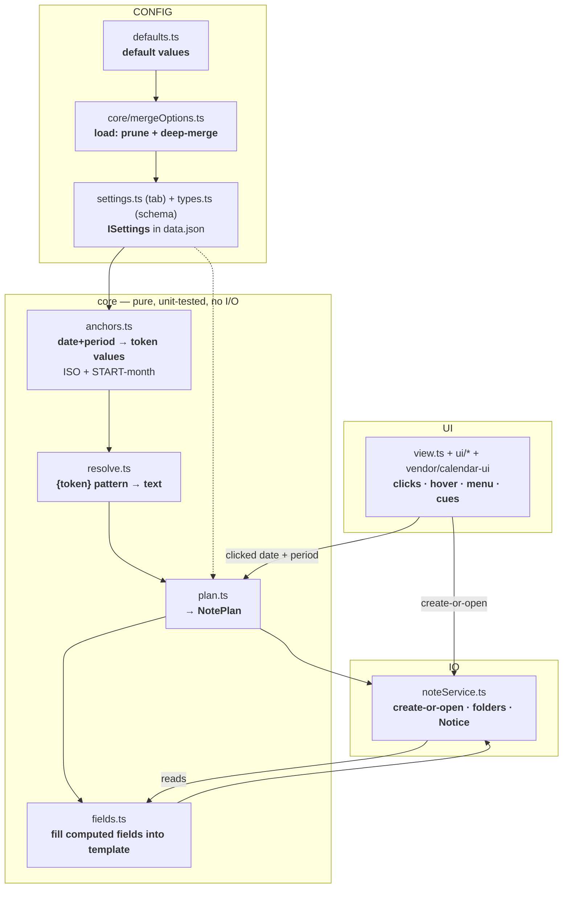
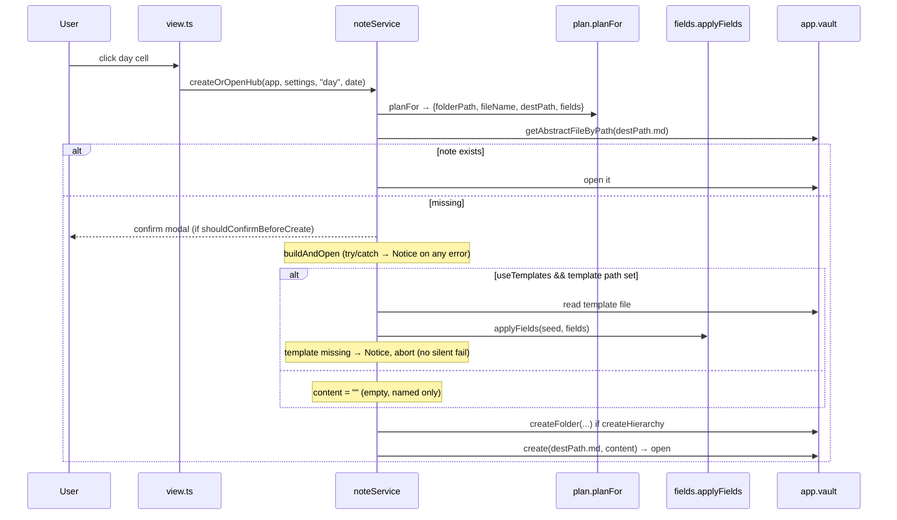

# ARCHITECTURE — Calendar "time-hierarchy" plugin (fork)

> Read this end-to-end before changing the code. It is written so a fresh
> agent (or human) can understand the whole system and make a surgical change
> with confidence. Quickstart + golden rules live in `AGENTS.md`.

---

## 1. What this plugin does

This is a fork of the (unmaintained) Obsidian **Calendar** plugin. It turns the
calendar grid into a launcher for a **time hierarchy of notes**:

- **Left-click a day** → create-or-open the day's note.
- **Left-click the week number** → the week's note.
- **Left-click the month / year** in the header → that month's / year's note.
- **Right-click a day** → also offers a day "Overview" note.

Each note is created at a **computed nested path** and given a **computed name +
parent link**, all driven from the plugin's own settings. "Create-or-open" means:
if the note exists, open it; otherwise create it (and any missing folders) and
open it. Existing notes are never duplicated.

Everything — output root, folder structure, file names, date formats, which
frontmatter fields are filled — is configurable, so the plugin works in any vault.
Defaults are generic (root `Calendar`, prefix `_HUB_`, ISO weeks, templates off).

**Independent of Templater.** The user's vault also has Templater `MT_*` templates
that make the same kind of notes. That is a *separate* mechanism; this plugin
shares no code or config with it. Don't couple them.

---

## 2. Repo layout (file → role → key exports)

```
src/
├── main.ts            Plugin lifecycle: load/prune settings, register view +
│                      commands + settings tab, inject CSS. (class CalendarPlugin)
├── types.ts           The settings SCHEMA (no logic): ISettings, PeriodKind,
│                      DateFormats, HubTemplates, ComputedField.
├── defaults.ts        THE one place for default values: DEFAULTS, KNOWN_SETTING_KEYS.
├── settings.ts        Settings TAB UI (CalendarSettingsTab) + re-exports
│                      ISettings/defaultSettings + appHasPeriodicNotesPluginLoaded.
├── styles.ts          PLUGIN_STYLES — small CSS injected at runtime (modal/settings).
├── constants.ts       VIEW_TYPE_CALENDAR, TRIGGER_ON_OPEN.
├── view.ts            CalendarView (ItemView): wires grid clicks/hover/menus to the
│                      core, refreshes cues on vault changes.
├── core/              ── the computation engine (pure) + the one writer (I/O) ──
│   ├── anchors.ts     DATE MATH: date+period → token VALUES (ISO + START-month).
│   │                  exports: startOfWeek, weekRange, tokenBag; type Bag.
│   ├── resolve.ts     RESOLVE: a {token} pattern → text. The single primitive.
│   │                  exports: resolve, unknownTokens, KNOWN_TOKENS.
│   ├── plan.ts        COMPOSE: → NotePlan {folderPath,fileName,destPath,fields}.
│   │                  exports: planFor, overviewPlan; types NotePlan, FieldValue.
│   ├── fields.ts      FIELD FILL + settings editor parse/serialize.
│   │                  exports: applyFields, parseFields, serializeFields.
│   ├── noteService.ts WRITER + façade (only I/O in core): create-or-open, folders,
│   │                  Notice on error. exports: createOrOpenHub,
│   │                  createOrOpenOverview, hubExists.
│   ├── mergeOptions.ts data.json upgrade: prune stale keys + deep-merge. mergeSettings.
│   └── __tests__/     jest specs (pure logic + real-template integration).
├── ui/
│   ├── modal.ts       ConfirmationModal + createConfirmationDialog.
│   ├── contextMenu.ts MENU_ITEMS registry + showCellMenu (right-click).
│   ├── stores.ts      svelte stores: settings, activeFile.
│   ├── utils.ts       getDateUIDFromFile (active-cell highlight only).
│   ├── sources/hubExists.ts  ICalendarSource that adds the "has-note" cue class.
│   ├── Calendar.svelte       thin wrapper around the vendored grid.
│   └── __mocks__/obsidian.ts jest mock of the obsidian module.
└── vendor/calendar-ui/  Vendored obsidian-calendar-ui 0.3.12 (Svelte grid). Nav.svelte
                         was patched to make the header month/year clickable; Day/WeekNum
                         carry the `has-note` cue CSS.
```

`main.js` (build output) and `data.json` (per-vault config) are **git-ignored**.

---

## 3. Data-flow architecture

Pure functions in the middle, I/O at the edges. To change a behaviour you edit
**one** block.



---

## 4. The naming pipeline (the heart)

### 4.1 Tokens and where their values come from

A *pattern* is a string with `{token}` placeholders. `resolve(pattern, bag)`
swaps each token for its value. The same function builds folder paths, file
names, and frontmatter field values.

| Token | Value | Source |
|---|---|---|
| `{prefix}` | name prefix, e.g. `_HUB_` (may be blank) | `settings.prefix` |
| `{Kind}` | `Day`/`Week`/`Month`/`Year` | the clicked period |
| `{year}` | e.g. `2026` | `settings.formats.year` applied to the anchor date |
| `{month}` | e.g. `Jun_2026` | `settings.formats.month` |
| `{day}` | e.g. `Jun04_2026` | `settings.formats.day` |
| `{weekId}` | e.g. `23_2026` | `settings.formats.weekId` (ISO `WW_GGGG`) |
| `{weekRange}` | e.g. `Jun01-07_2026` | computed range string (see `weekRange`) |
| `{date:FMT}` | raw moment format, e.g. `{date:dddd}`→`Thursday` | the clicked date |

So changing `2026`→`26` is just editing the **Year date format** setting; the
token picks it up. This mapping is what `anchors.tokenBag` builds.

### 4.2 The two invariants that stay in CODE (never make them settings)

`anchors.ts` owns the only "smart" date math. Users arrange tokens; they cannot
break this:

- **ISO weeks** (`useIsoWeeks`): the week starts Monday; `{weekId}` uses ISO week
  + ISO week-year (`WW_GGGG`). `startOfWeek` handles ISO vs locale.
- **START-month rule:** a week — and **all of its days** — are placed under the
  Year/Month of the week's **start** (its Monday). So a day on 2026-05-01 nests
  under `Month_Apr_2026` because its ISO week started Mon 2026-04-27. Implemented
  by choosing the *anchor date* in `tokenBag`: week/day take year+month from the
  week start; month/year take them from the date itself.

If you ever expose folder structure to users, keep these two computed in code —
they are the worst thing to misconfigure (a wrong week start silently forks the
hierarchy into duplicate folders).

### 4.3 Patterns (per period, configurable)

`settings.folderPatterns[period]`, `settings.filePatterns[period]`, and
`settings.computedFields[period]` are resolved by `plan.planFor`. Defaults
(in `defaults.ts`) reproduce a `Year_/Month_/Week_/Day_` hierarchy with `_HUB_`
file names; the **Week** `name` field keeps `{weekRange}` while the file uses
`{weekId}` — both are just formulas.

---

## 5. Create-or-open flow



---

## 6. Settings & data.json lifecycle

- **Schema:** `ISettings` in `types.ts`. **Defaults:** `DEFAULTS` in `defaults.ts`
  (the single edit point for out-of-the-box behaviour).
- **Load (`main.loadOptions`):** `mergeSettings(saved)` starts from `DEFAULTS`,
  copies only `KNOWN_SETTING_KEYS` from the saved `data.json` (pruning stale keys
  like a previous version's `wordsPerDot`), and deep-merges object-valued settings
  so newly added sub-keys get their defaults. Then it re-saves the cleaned config.
- **Write (`main.writeOptions`):** updates the `settings` store and `saveData`s.
- **Settings tab (`settings.ts`):** sections = Calendar grid · Output & behaviour ·
  Naming basics · Templates (with live ✓/✗ path validation) · a collapsible
  **Advanced** (folder/file patterns + a per-period computed-fields textarea) ·
  Reset-to-defaults. The tab container gets class `calendar-settings` (styled by
  `styles.ts`).

---

## 7. The computed-fields model (frontmatter)

The **template is the source of the whole note.** `applyFields` copies it and
**only overwrites** the fields listed in `settings.computedFields[period]`; every
other field/line is left verbatim. If templates are off, the note is created empty
(just the computed name).

- A `ComputedField` is `{ field, formula, list? }`. `formula` uses the §4 tokens.
  `list: true` targets the first `- "[[..]]"` item under `field:` (e.g.
  `related_notes`); otherwise the scalar `field: value` line is replaced.
- In the settings UI, each period's list is edited as text — one line per field:
  `field = formula`, or `field[] = formula` for a list field. `parseFields` /
  `serializeFields` convert between that text and `ComputedField[]`.
- **Adding a computed field** (e.g. `description`) is one new line — no code change.
  A future "compute it with code/AI instead of a token pattern" would be a new
  branch in the field-fill step; the call site is `noteService.buildAndOpen` →
  `applyFields`.

---

## 8. "How do I…?" (change X → edit Y)

| Goal | Edit |
|---|---|
| Change a default (root, prefix, formats, patterns) | `src/defaults.ts` only |
| Add/rename a setting | `src/types.ts` (schema) + `src/defaults.ts` (default) + `src/settings.ts` (UI) |
| Change the date math (ISO, START-month, week start) | `src/core/anchors.ts` |
| Add a naming token | `src/core/anchors.ts` (add to `tokenBag.values`) + `src/core/resolve.ts` (`KNOWN_TOKENS`) + doc the legend in `src/settings.ts` |
| Change a folder/file name pattern | settings (Advanced) — or its default in `defaults.ts` |
| Change which frontmatter fields are computed | settings (Advanced computed fields) — or `defaults.ts` |
| Change create/open behaviour or error messages | `src/core/noteService.ts` |
| Change the confirm modal | `src/ui/modal.ts` (+ `styles.ts` for size) |
| Change right-click menu items | `src/ui/contextMenu.ts` (the `MENU_ITEMS` array) |
| Change the "has note" cue | `src/ui/sources/hubExists.ts` (+ Day/WeekNum `.svelte` CSS) |
| Change the data.json prune/upgrade rule | `src/core/mergeOptions.ts` |
| Adjust modal width / settings field sizing | `src/styles.ts` |

### Worked example — add a clickable "quarter" period
1. `types.ts`: add `"quarter"` to `PeriodKind`.
2. `anchors.ts`: give `tokenBag` a `{quarter}` value (and any new format).
3. `defaults.ts`: add `folderPatterns.quarter`, `filePatterns.quarter`,
   `computedFields.quarter`.
4. `plan.ts`: works unchanged (it's generic over `PeriodKind`).
5. `vendor/calendar-ui`: add a click target + thread an `onClickQuarter` prop
   through to `view.ts` (which calls `createOrOpenHub(..., "quarter", ...)`).
6. Add a `plan.spec.ts` vector. Build + deploy.

---

## 9. Build, test, deploy

> **Node:** use **Node 24 via nvm**. A bare shell here defaults to a broken
> system Node 12, so every command starts by sourcing nvm.

```bash
export NVM_DIR="$HOME/.nvm"; . "$NVM_DIR/nvm.sh"; nvm use 24
npm install              # if node_modules is absent

npx jest                 # pure-logic + real-template + prune tests
npm run build            # = lint (svelte-check && eslint) && rollup -c  → main.js
```

**Deploy** (no installer): copy the build output into the vault plugin folder.
There is **no `styles.css`** — rollup is `emitCss: false`; the plugin injects CSS
at runtime from `styles.ts`. Only `main.js` + `manifest.json` are deployed.

```bash
DEST="<vault>/.obsidian/plugins/calendar"
cp main.js "$DEST/main.js"          # back up the old one first if it matters
cp manifest.json "$DEST/manifest.json"
# then FULLY restart Obsidian (a hot plugin-reload can race data.json)
```

---

## 10. Testing strategy

- **What's tested (jest, headless):** the entire pure engine —
  `plan.spec` (the canonical date→path vectors = generalisation proof,
  format-flip, blank-prefix, hierarchy-off, vault-root, computed fields),
  `resolve.spec`, `fields.spec` (apply + parse/serialize), `mergeOptions.spec`
  (prune/deep-merge), and `integration.spec` which reads the **real `ST_*`
  templates** (when present) and asserts the generated note's path/name/parent.
- **The obsidian mock** (`src/ui/__mocks__/obsidian.ts`) lets core import
  `obsidian` types without the real module. The pure modules don't import
  obsidian at all, which is what keeps them testable.
- **What is NOT unit-tested:** the settings tab UI and the Svelte grid (they only
  run inside Obsidian/Electron). After changing them, verify in-app — see the
  checklist in `HUB_FEATURE.md`. A throw in `settings.display()` blanks the whole
  settings page, so render it manually after edits.

---

## 11. Constraints & gotchas (read before editing)

- **Keep `core/*` pure** (no `obsidian`, no DOM) except `noteService.ts`, which is
  the single I/O boundary. This is what makes the engine unit-testable.
- **Type-only imports stay `import type`.** `types.ts` imports
  `ILocaleOverride`/`IWeekStartOption` from `vendor/calendar-ui` as `import type`
  so jest/rollup don't pull a Svelte module into the pure path at runtime.
- **eslint quirks:** the `object` type is banned (use `Record<string, unknown>`);
  `any` needs an inline `// eslint-disable-next-line` disable. `npm run build`
  fails (and won't emit `main.js`) if lint fails — so a stale `main.js` may remain;
  always check the build exit code.
- **svelte-check** reports ~8 warnings and harmless `lib/mappings.wasm` source-map
  lines under Node 24, but **0 errors** — that's the passing state.
- **Never make the START-month / ISO math configurable** (§4.2).
- **`main.js` and `data.json` are git-ignored.** Commits contain `src/` + docs;
  the consumer builds `main.js`. The user syncs the *built* plugin folder via git
  separately (so `main.js` lives there, not in this repo).
- **Don't reintroduce coupling to Templater.** The `MT_*` templates are a separate
  system by design.

---

## 12. History / design record

The full design rationale and the grilling rounds that produced this architecture
live in the vault: `0_Inbox/polish_plan_for_calendar_plugin.md` (and the original
`plan_for_calendar_plugin.md`). The end-user "set these settings → get that
layout" guide is `0_Inbox/adjust_calendar_settting.md`. Those are outside this
repo; this file is the authoritative in-repo reference.
