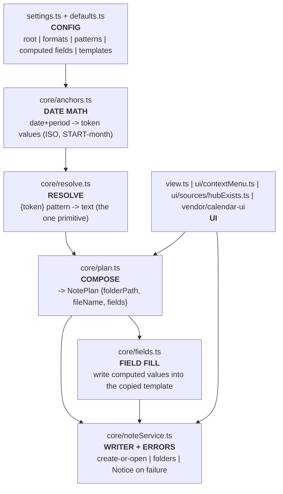

# Calendar → Time-Hierarchy HUB feature (fork)

Clicking the calendar grid creates-or-opens nested time notes (Year / Month /
Week / Day, plus a right-click day Overview). All naming, paths, formats, and
which frontmatter fields get computed are driven from the plugin's own settings —
it works in any vault. The Templater `MT_*` templates remain a **separate,
independent** way to make the same notes; nothing is shared between them.

## Architecture — one small computation engine

Pure functions in the middle, I/O at the edge. To change a behaviour you edit one
block:



| Concern | File |
|---|---|
| All settings values (the ONE place to edit defaults) | `src/defaults.ts` |
| Settings schema (types) | `src/types.ts` |
| Settings tab UI (+ path ✓/✗, reset, computed-fields editor) | `src/settings.ts` |
| Date math (ISO week, START-month) → token values | `src/core/anchors.ts` |
| `{token}` pattern resolution + validation | `src/core/resolve.ts` |
| Compose a NotePlan (paths, file, computed fields) | `src/core/plan.ts` |
| Write computed values into a copied template | `src/core/fields.ts` |
| Create-or-open + folders + error Notices | `src/core/noteService.ts` |
| data.json upgrade/prune (drop stale keys) | `src/core/mergeOptions.ts` |
| Clicks, hover, right-click menu, "hub exists" cue | `src/view.ts`, `src/ui/…` |

## Naming model

- **Tokens:** `{prefix} {Kind} {year} {month} {day} {weekId} {weekRange}` plus a
  raw `{date:MOMENT_FORMAT}` escape hatch. Date tokens' formats are configurable.
- **Patterns** (per period) build the folder, the file name, and each computed
  frontmatter field. The START-month + ISO math stays in code (`anchors.ts`); only
  the arrangement of tokens is configurable, so paths can't be silently broken.
- **Templates are optional** (default off; none are shipped). Off → an empty note
  with the computed name. On → the template file is copied whole and only the
  listed computed fields are overwritten.
- **Generic defaults:** root `Calendar`, prefix `_HUB_`, ISO weeks, templates off.
  A specific vault's layout lives in its `data.json` / the settings tab — see
  `0_Inbox/adjust_calendar_settting.md` in the vault for a worked mapping.

## Build, test & deploy

```
export NVM_DIR="$HOME/.nvm"; . "$NVM_DIR/nvm.sh"; nvm use 24
npm install        # if node_modules absent
npx jest           # pure-logic + real-template + prune tests
npm run build      # svelte-check + eslint + rollup  -> main.js
# deploy: back up the vault main.js, then copy main.js + manifest.json into
#   <vault>/.obsidian/plugins/calendar/
```
svelte-check emits harmless `lib/mappings.wasm` source-map lines under Node 24 but
reports "0 errors". Component CSS (incl. the cue) is JS-injected; no styles.css.

## Manual UI verification (must be done in Obsidian)

Reload/restart Obsidian after deploying, then:

- [ ] **Panel renders / no console errors** (devtools, Ctrl/Cmd+Shift+I).
- [ ] **Day create/open:** click an empty day → confirm → creates the nested
      `…/Day_<…>/_HUB_Day_<…>.md`. Open it: `name:` and `related_notes:` (parent
      week) are filled; the rest of the template is intact. Click again → just
      opens (no duplicate).
- [ ] **Missing template surfaces a Notice:** temporarily set a wrong Day template
      path in settings (it shows ✗) → click → a Notice names the bad path (no more
      silent failure). Restore the path.
- [ ] **Week / Month / Year** clicks create the right notes; a cross-month week
      (e.g. a May day of an Apr-start week) nests under the Apr month (START-month).
- [ ] **Settings:** change *Day date format* to `MMM_DD_YYYY` → a new day note is
      `…_Day_Jun_04_2026`. *Reset all settings to defaults* restores generics.
- [ ] **Templates off:** turn *Use templates* off → a click creates an empty note
      with the correct name/location.
- [ ] **Cues / right-click menu / hover** work; the Overview menu item creates the
      `_Overview_Day_<…>` note.
